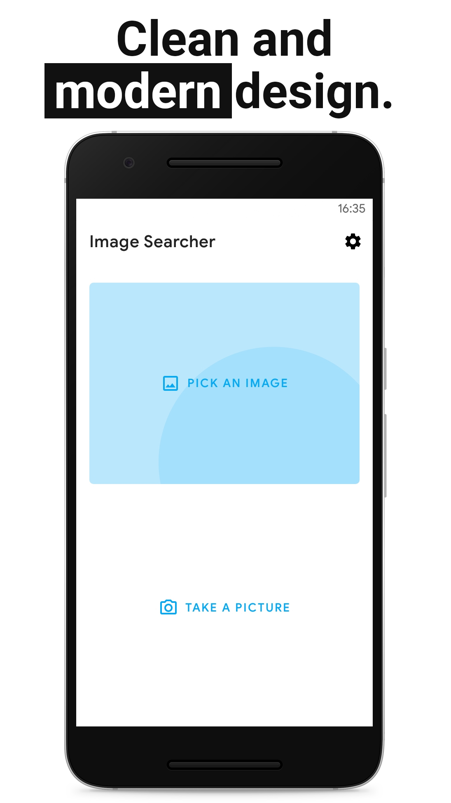
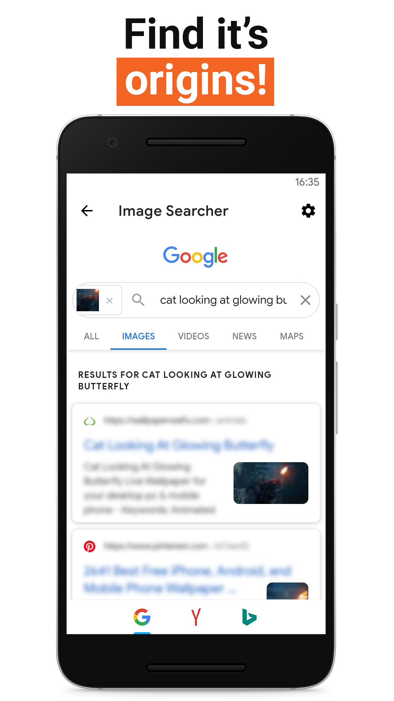
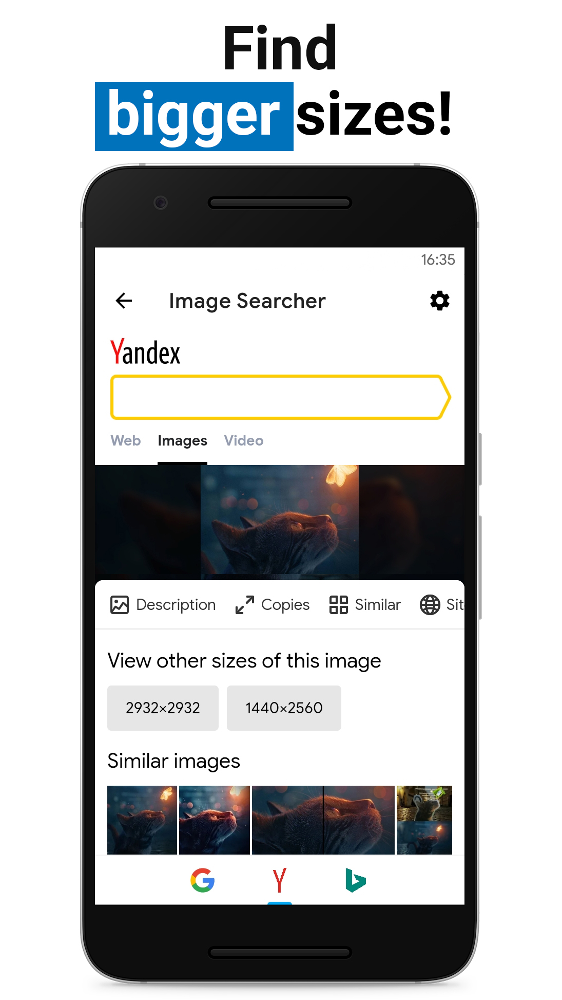
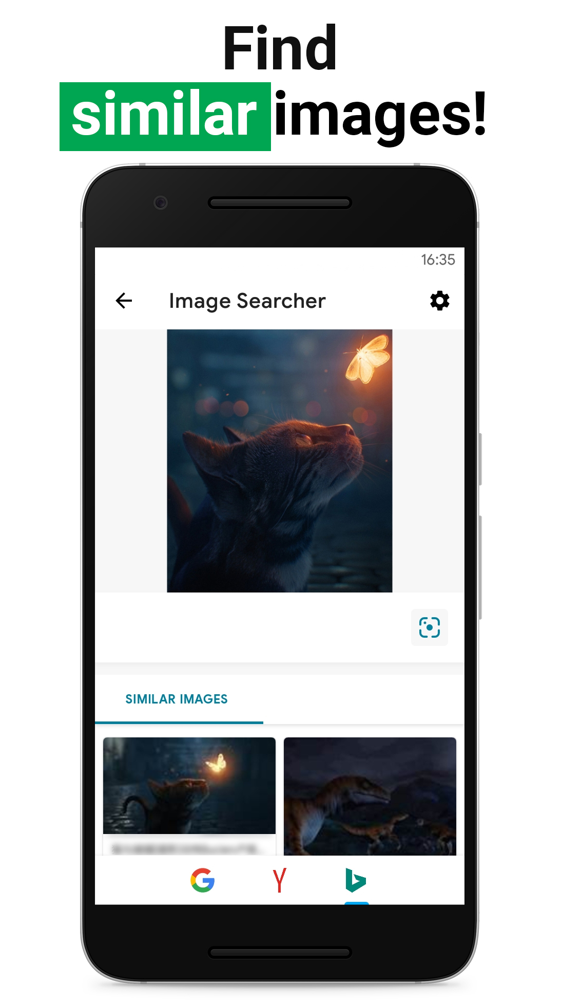
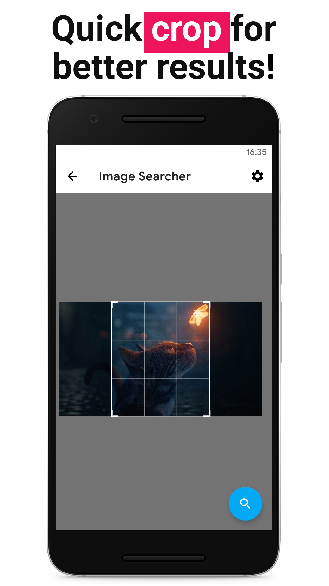

# Reverse Image Searcher    


Reverse Image Searcher allows you to search images from your phone in multiple search engines at the same time! It is an open source, ad free and has a modern UI.

The app will be available on F-Droid soon.  

[](https://play.google.com/store/apps/details?id=com.hermesjunior.reverseimagesearcher)

    

## Licensing

```
Copyright 2022, Hermes Junior

Licensed under the Apache License, Version 2.0 (the "License");
you may not use this file except in compliance with the License.
You may obtain a copy of the License at

   http://www.apache.org/licenses/LICENSE-2.0

Unless required by applicable law or agreed to in writing, software
distributed under the License is distributed on an "AS IS" BASIS,
WITHOUT WARRANTIES OR CONDITIONS OF ANY KIND, either express or implied.
See the License for the specific language governing permissions and
limitations under the License.
```
